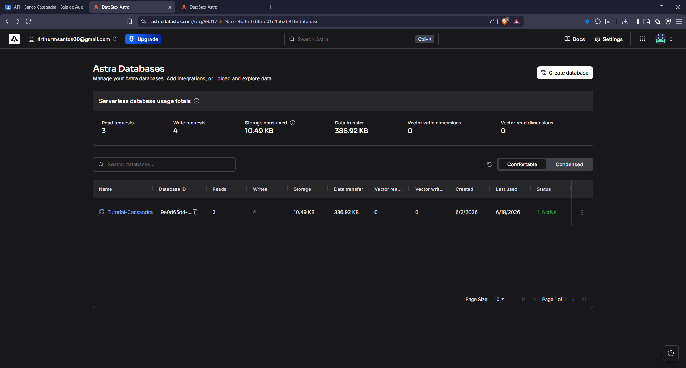
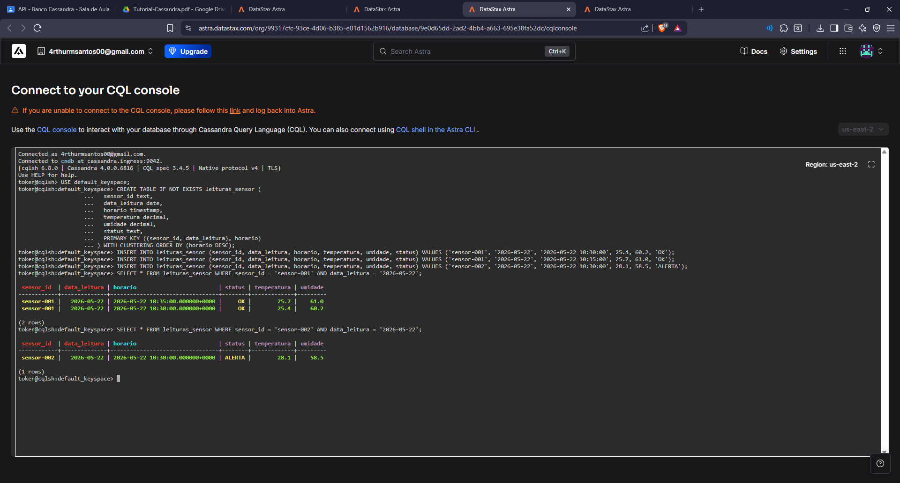
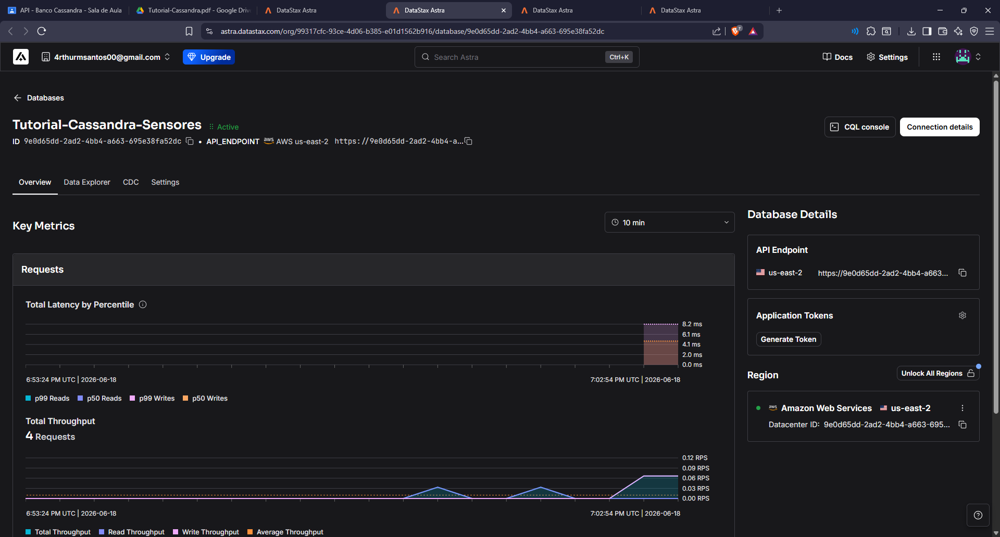
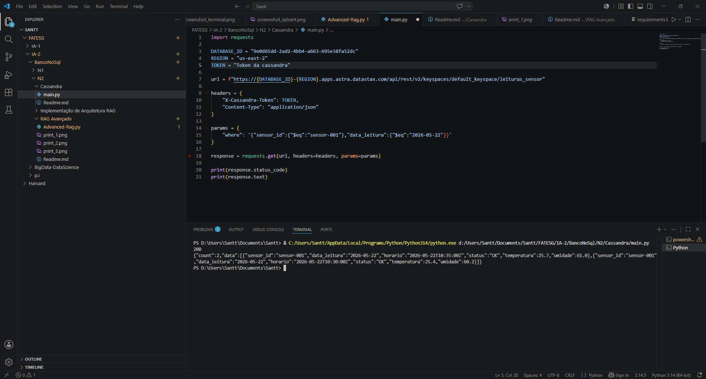

# API - Banco Cassandra

Atividade prática da disciplina de **Banco de Dados NoSQL** do curso de Ciência de Dados e Inteligência Artificial (FATESG).

## Objetivo

Replicar o tutorial de uso do Apache Cassandra via **DataStax Astra**, criando um banco de dados serverless, modelando uma tabela de leituras de sensores via CQL e, por fim, consumir a API REST do banco utilizando **Python**.

---

## Tecnologias Utilizadas

- [DataStax Astra](https://astra.datastax.com) — plataforma serverless baseada em Apache Cassandra
- **CQL (Cassandra Query Language)** — linguagem de consulta do Cassandra
- **Python** + biblioteca `requests` — para consumo da API REST

---

## Etapas Realizadas

### 1. Criação do banco no DataStax Astra

Foi criado um banco de dados serverless chamado **Tutorial-Cassandra-Sensores** na plataforma DataStax Astra, utilizando o provedor **AWS** na região **us-east-2**.


*Dashboard do Astra com o banco ativo e as métricas de uso.*

---

### 2. Modelagem e inserção via CQL Console

Com o banco ativo, foi acessado o **CQL Console** para criar a tabela `leituras_sensor` e inserir registros de sensores.

```cql
USE default_keyspace;

CREATE TABLE IF NOT EXISTS leituras_sensor (
    sensor_id text,
    data_leitura date,
    horario timestamp,
    temperatura decimal,
    umidade decimal,
    status text,
    PRIMARY KEY ((sensor_id, data_leitura), horario)
) WITH CLUSTERING ORDER BY (horario DESC);

-- Inserção de dados
INSERT INTO leituras_sensor (sensor_id, data_leitura, horario, temperatura, umidade, status)
VALUES ('sensor-001', '2026-05-22', '2026-05-22 10:30:00', 25.4, 60.2, 'OK');

INSERT INTO leituras_sensor (sensor_id, data_leitura, horario, temperatura, umidade, status)
VALUES ('sensor-001', '2026-05-22', '2026-05-22 10:35:00', 25.7, 61.0, 'OK');

INSERT INTO leituras_sensor (sensor_id, data_leitura, horario, temperatura, umidade, status)
VALUES ('sensor-002', '2026-05-22', '2026-05-22 10:30:00', 28.1, 58.5, 'ALERTA');

-- Consultas
SELECT * FROM leituras_sensor WHERE sensor_id = 'sensor-001' AND data_leitura = '2026-05-22';
SELECT * FROM leituras_sensor WHERE sensor_id = 'sensor-002' AND data_leitura = '2026-05-22';
```


*Terminal CQL com a criação da tabela, inserções e resultados das consultas.*

---

### 3. Métricas do banco após as operações

Após as operações de escrita e leitura, o painel do banco exibiu as métricas atualizadas com o throughput das requisições.


*Dashboard interno do banco Tutorial-Cassandra-Sensores mostrando latência e throughput.*

---

### 4. Consumo da API REST com Python

A etapa adicional da atividade foi conectar ao banco via **API REST** utilizando Python, retornando os dados da tabela `leituras_sensor`.

```python
import requests

DATABASE_ID = "9e0d65dd-2ad2-4bb4-a663-695e38fa52dc"
REGION = "us-east-2"
TOKEN = "AstraCS:mUzwYcxfBsEMurWaPYmHXsRl:c0f5869d6f..."

url = f"https://{DATABASE_ID}-{REGION}.apps.astra.datastax.com/api/rest/v2/keyspaces/default_keyspace/leituras_sensor"

headers = {
    "X-Cassandra-Token": TOKEN,
    "Content-Type": "application/json"
}

params = {
    "where": '{"sensor_id":{"$eq":"sensor-001"},"data_leitura":{"$eq":"2026-05-22"}}'
}

response = requests.get(url, headers=headers, params=params)

print(response.status_code)
print(response.text)
```


*VSCode com o script Python e o retorno da API com status 200 e os dados dos sensores.*

**Retorno da API (status 200):**
```json
{
  "count": 2,
  "data": [
    {"sensor_id": "sensor-001", "data_leitura": "2026-05-22", "horario": "2026-05-22T10:35:00Z", "status": "OK", "temperatura": 25.7, "umidade": 61.0},
    {"sensor_id": "sensor-001", "data_leitura": "2026-05-22", "horario": "2026-05-22T10:30:00Z", "status": "OK", "temperatura": 25.4, "umidade": 60.2}
  ]
}
```

---

## Conceitos Aprendidos

### O que é um Keyspace?
No Cassandra, um **keyspace** é equivalente a um banco de dados nos sistemas relacionais. Ele agrupa as tabelas e define a estratégia de replicação.

```
Banco relacional:  banco_de_dados → tabelas
Cassandra:         keyspace       → tabelas
```

### Modelagem orientada a consultas
Diferente dos bancos relacionais onde primeiro modelamos as entidades, no Cassandra **a modelagem começa pelas perguntas que queremos responder**:

> *"Quais são as leituras de um sensor em uma determinada data?"*

Por isso a `PRIMARY KEY` foi definida como `((sensor_id, data_leitura), horario)` — os dados do mesmo sensor e data ficam na mesma partição, e o horário organiza as leituras dentro dela.

---

## Estrutura do Projeto

```
Cassandra/
├── main.py       # Script Python para consumo da API REST
├── print1.png    # Print Dashboard Cassandra
├── print2.png    # Print CQL-Console Cassandra
├── print3.png    # Print Overview Cassandra
├── print4.png    # Print Codigo Python connectando codigo com api Cassandra
└── README.md     # Este arquivo
```
---
