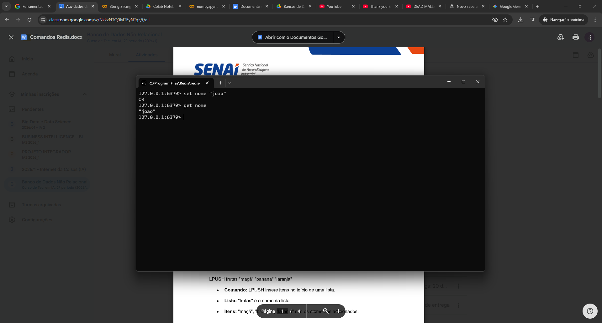
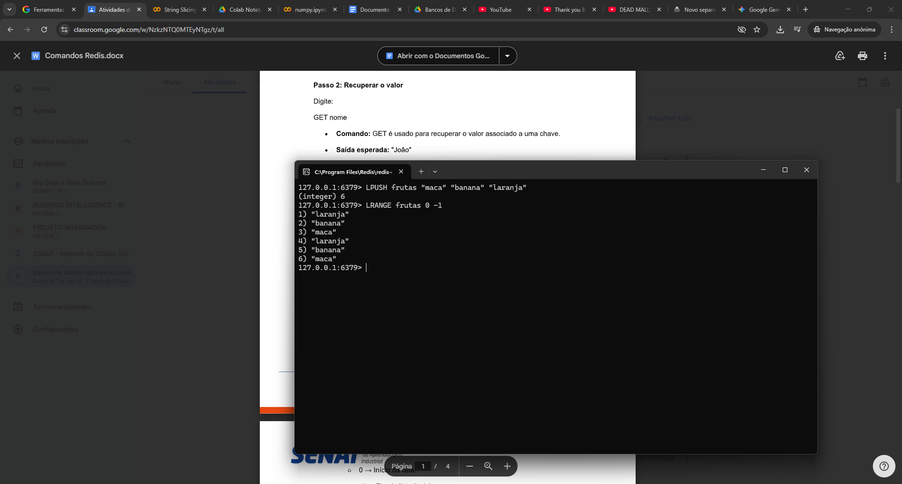
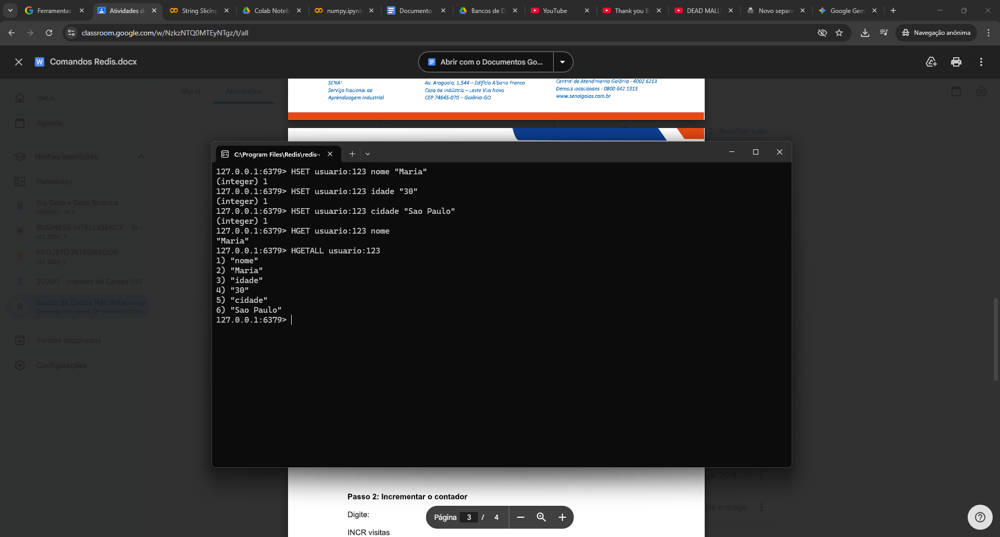
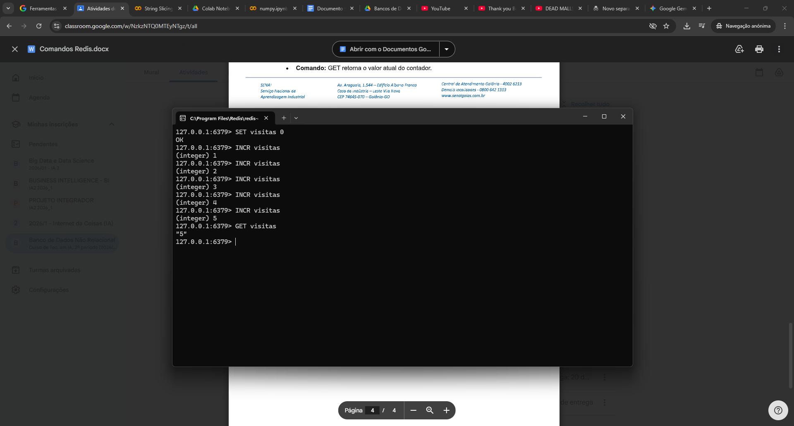

# Tarefa Sobre Redis

Atividade aprendendo a utilizar o Redis

## Provas do funcionamento

### 1. Armazenando e Recuperando uma String

### 2 . Usando Listas

### 3 . Trabalhando com Hashes

### 4 . Incrementando um Contador
