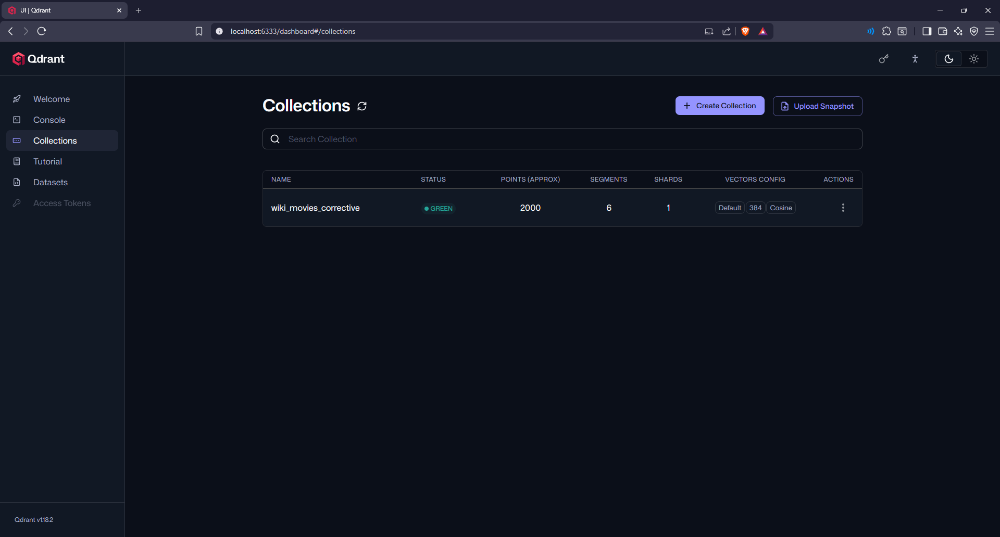
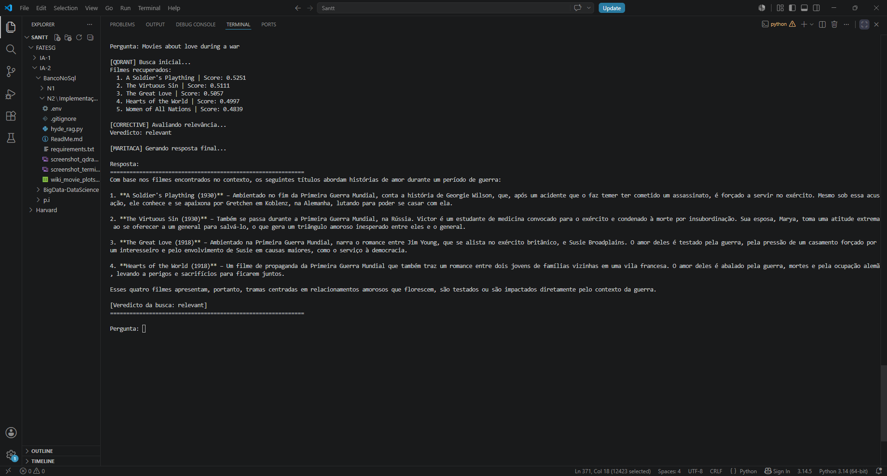

# Corrective RAG — Wikipedia Movie Plots

Trabalho Final N2 — Banco de Dados Não Relacional  
FATESG — Curso de Tecnologia em IA, 2º período (2026/1)

## Integrantes do grupo

1. Arthur Machado Santos
2. Guilherme Nogueira Medeiros

---

## O que é Corrective RAG?

O RAG tradicional (Retrieval-Augmented Generation) funciona em dois passos: busca documentos relevantes em um banco vetorial e passa esses documentos como contexto para uma LLM gerar a resposta. O problema é que, se a busca retornar resultados ruins, a LLM vai gerar uma resposta ruim — ela não tem como saber que o contexto que recebeu é irrelevante.

O **Corrective RAG** resolve isso adicionando uma etapa de **avaliação e correção** entre a busca e a geração. Antes de gerar a resposta, o sistema pede para a LLM avaliar se os documentos recuperados realmente respondem à pergunta do usuário. Com base nessa avaliação, o sistema toma uma decisão:

- **Relevante**: os documentos são bons → gera a resposta normalmente.
- **Parcialmente relevante**: os documentos têm alguma relação, mas não são ideais → expande a busca reformulando a pergunta e combinando os novos resultados com os originais.
- **Irrelevante**: os documentos não têm relação com a pergunta → reformula a pergunta completamente e faz uma nova busca do zero.

### Fluxo da arquitetura

```
Pergunta do usuário
        │
        ▼
┌─────────────────┐
│  Busca vetorial │  ← Qdrant (similaridade por cosseno)
│    (top 5)      │
└────────┬────────┘
         │
         ▼
┌─────────────────┐
│   Avaliação de  │  ← LLM julga: relevant / partially_relevant / irrelevant
│   relevância    │
└────────┬────────┘
         │
    ┌────┴─────┐
    │          │
    ▼          ▼
 relevant   irrelevant / partially_relevant
    │          │
    │          ▼
    │   ┌─────────────────┐
    │   │ Reformula query │  ← LLM reescreve a pergunta
    │   └────────┬────────┘
    │            │
    │            ▼
    │   ┌─────────────────┐
    │   │  Nova busca no  │  ← Qdrant (com query reformulada)
    │   │     Qdrant      │
    │   └────────┬────────┘
    │            │
    └─────┬──────┘
          │
          ▼
┌─────────────────┐
│  Geração final  │  ← LLM gera resposta com o melhor contexto
│   (Maritaca)    │
└─────────────────┘
```

### Qual problema o Corrective RAG resolve?

No RAG básico, a qualidade da resposta depende inteiramente da qualidade da busca vetorial. Se o embedding da pergunta não for semanticamente próximo dos documentos certos (por diferença de idioma, vocabulário técnico, ou ambiguidade), o sistema retorna documentos irrelevantes e a LLM "alucina" uma resposta com base em contexto ruim.

O Corrective RAG mitiga isso usando a própria LLM como um "juiz" que detecta quando a busca falhou, permitindo uma segunda chance com uma query reformulada.

---

## Stack tecnológica

| Componente | Tecnologia |
|---|---|
| Banco vetorial | **Qdrant** (local via Docker) |
| Modelo de embeddings | `sentence-transformers/all-MiniLM-L6-v2` (384 dimensões) |
| LLM para avaliação e geração | **Maritaca AI** (`sabiazinho-4`) via API OpenAI-compatible |
| Linguagem | Python 3 |
| Dataset | Wikipedia Movie Plots (2.000 filmes) |

### Papel do banco vetorial

O Qdrant armazena os embeddings de 2.000 filmes e realiza busca por similaridade de cosseno. Cada ponto no Qdrant contém o vetor do filme e um payload com título, ano, gênero, diretor e sinopse. A busca retorna os 5 filmes mais similares à pergunta do usuário (ou à pergunta reformulada, caso o mecanismo corretivo seja acionado).



### Como os dados foram processados

1. O CSV `wiki_movie_plots_deduped.csv` é carregado com pandas
2. Linhas sem título ou sinopse são descartadas
3. Para cada filme, um texto unificado é montado concatenando título, ano, gênero, diretor, elenco e sinopse
4. O modelo `all-MiniLM-L6-v2` gera embeddings de 384 dimensões para cada texto
5. Os embeddings são inseridos no Qdrant em lotes de 64, com normalização L2

### Como o contexto é enviado para a LLM

A LLM recebe um prompt de sistema definindo seu papel ("assistente especializado em filmes, responde em português, usa somente o contexto fornecido") e um prompt de usuário contendo o contexto recuperado (os 5 filmes com seus dados completos e score de similaridade) seguido da pergunta original. A LLM é instruída a responder exclusivamente com base no contexto — se não houver informação suficiente, deve dizer isso.

---

## Instruções de execução

### Pré-requisitos

- Python 3.10+
- Docker (para rodar o Qdrant)
- Chave de API da Maritaca AI

### 1. Subir o Qdrant via Docker

```bash
docker run -p 6333:6333 -p 6334:6334 qdrant/qdrant
```

### 2. Instalar dependências

```bash
pip install pandas sentence-transformers qdrant-client openai python-dotenv tqdm
```

### 3. Configurar variáveis de ambiente

Criar um arquivo `.env` na raiz do projeto:

```
MARITACA_API_KEY=sua_chave_aqui
```

### 4. Colocar o dataset

O arquivo `wiki_movie_plots_deduped.csv` deve estar na raiz do projeto. Disponível em: https://www.kaggle.com/datasets/jrobischon/wikipedia-movie-plots

### 5. Executar

```bash
python corrective_rag.py
```

Na primeira execução, o script cria a coleção no Qdrant e indexa os 2.000 filmes (~38 segundos). Nas execuções seguintes, a indexação é pulada automaticamente.

---

## Exemplos de perguntas e respostas

### Exemplo 1 — Busca relevante (sem correção)

**Pergunta:** `What movies are about a detective solving a murder?`

**Filmes recuperados:**
| # | Título | Score |
|---|--------|-------|
| 1 | Murder on a Honeymoon | 0.5789 |
| 2 | Murder at Midnight | 0.5384 |
| 3 | The Crime Doctor | 0.5375 |
| 4 | Murder by Television | 0.5368 |
| 5 | Lady Killer | 0.5355 |

**Veredicto:** `relevant` — busca direta, sem correção necessária.

**Resposta da LLM:** Identificou 3 filmes que se encaixam no tema (Murder on a Honeymoon, Murder at Midnight, Murder by Television) e explicou por que The Crime Doctor não se encaixa perfeitamente, demonstrando capacidade de análise crítica do contexto.

---

### Exemplo 2 — Busca relevante com tema composto

**Pergunta:** `Movies about love during a war`

**Filmes recuperados:**
| # | Título | Score |
|---|--------|-------|
| 1 | A Soldier's Plaything | 0.5251 |
| 2 | The Virtuous Sin | 0.5111 |
| 3 | The Great Love | 0.5057 |
| 4 | Hearts of the World | 0.4997 |
| 5 | Women of All Nations | 0.4839 |

**Veredicto:** `relevant` — mesmo com dois temas combinados (amor + guerra), a busca retornou filmes precisos.

**Resposta da LLM:** Identificou 4 filmes ambientados na Primeira Guerra Mundial com tramas românticas centrais, demonstrando que o embedding captura bem a interseção de temas quando o dataset contém conteúdo compatível.



---

### Exemplo 3 — Busca irrelevante com correção (tema moderno ausente no dataset)

**Pergunta:** `Movies about time travel and romance`

**Busca inicial retornou** filmes genéricos sem relação (Girl Shy, This Is the Night, Sweet Memories) com scores baixos (~0.45).

**Veredicto:** `irrelevant` → mecanismo corretivo ativado.

**Pergunta reformulada pela LLM:** `Films combining temporal displacement with romantic storylines`

**Nova busca retornou** filmes como A Calamitous Elopement, Romance, Design for Living — ainda sem match, pois o dataset (filmes de 1901–1930s) não contém filmes sobre viagem no tempo.

**Resposta da LLM:** Informou corretamente que nenhum dos filmes recuperados trata de viagem no tempo, em vez de inventar uma resposta falsa.

---

### Exemplo 4 — Busca irrelevante com correção (pergunta em português)

**Pergunta:** `Quais filmes falam sobre inteligência artificial e redes neurais?`

**Busca inicial retornou** filmes completamente fora do tema (scores muito baixos, ~0.25).

**Veredicto:** `irrelevant` → mecanismo corretivo ativado.

**Pergunta reformulada pela LLM:** `Which movies explore the themes of artificial consciousness and neural networks?`

**Nova busca:** scores melhoraram ligeiramente (~0.35), mas ainda sem filmes relevantes — tema inexistente no dataset de filmes antigos.

**Resposta da LLM:** Informou que nenhum filme do contexto aborda inteligência artificial, respondendo com transparência.

---

## Principais resultados

O Corrective RAG demonstrou três comportamentos distintos:

1. **Quando a busca acerta** (veredicto `relevant`): o sistema funciona como um RAG tradicional, sem overhead adicional. Os filmes recuperados têm alta relevância semântica e a resposta é precisa.

2. **Quando a busca falha e o tema existe no dataset** (veredicto `irrelevant` com correção bem-sucedida): a reformulação da query pela LLM usa sinônimos e termos em inglês, o que pode melhorar o match semântico com os embeddings.

3. **Quando o tema não existe no dataset** (veredicto `irrelevant` sem solução): mesmo após correção, o sistema reconhece a falta de dados e responde com transparência em vez de alucinar — comportamento desejável e superior ao RAG básico, que poderia forçar uma resposta com contexto irrelevante.

O mecanismo corretivo adiciona 1-2 chamadas extras à LLM (avaliação + reformulação), mas evita respostas alucinadas, que é o principal problema do RAG ingênuo.

---

## Limitações encontradas

- **Custo de latência**: cada pergunta que aciona o mecanismo corretivo faz 2-3 chamadas adicionais à API da Maritaca (avaliação, reformulação, e eventualmente uma nova geração), aumentando o tempo de resposta.

- **Dataset limitado**: o CSV contém majoritariamente filmes de 1901 a 1930, o que limita a variedade de temas disponíveis. Perguntas sobre temas modernos (IA, ficção científica contemporânea) sempre falham independente da correção.

- **Avaliação binária na prática**: o veredicto `partially_relevant` raramente é acionado — o modelo tende a classificar como `relevant` ou `irrelevant`, reduzindo o mecanismo de 3 estados a 2 na prática.

- **Reformulação nem sempre eficaz**: quando o tema simplesmente não existe no dataset, a reformulação muda as palavras mas não resolve o problema fundamental da ausência de dados.

- **Dependência da qualidade do embedding**: o modelo `all-MiniLM-L6-v2` é leve (384 dimensões) e funciona bem para inglês, mas tem desempenho inferior com perguntas em português, já que os embeddings dos filmes estão em inglês.

- **Sem chunking**: cada filme é indexado como um documento único. Para textos mais longos ou bases de conhecimento maiores, seria necessário implementar chunking com sobreposição.

---

## Aprendizados do grupo

- A diferença entre RAG ingênuo e Corrective RAG ficou clara na prática: no RAG básico, a LLM recebe qualquer contexto e tenta responder, mesmo que os documentos recuperados não tenham relação com a pergunta. O Corrective RAG adiciona uma camada de julgamento que detecta quando a busca falhou, evitando respostas alucinadas.

- Trabalhar com o Qdrant mostrou como um banco vetorial funciona por dentro: criar coleções, definir distância (cosseno), indexar embeddings em lotes, e fazer buscas por similaridade. A interface web do Qdrant ajudou a visualizar os dados e validar que a indexação estava correta.

- A qualidade do embedding impacta diretamente a busca. O modelo `all-MiniLM-L6-v2` é leve e rápido, mas tem limitações com perguntas em português já que o dataset está em inglês. Em um cenário real, usar um modelo multilíngue ou embeddings maiores melhoraria os resultados.

- O mecanismo de reformulação de query mostrou que a LLM pode ser usada não só para gerar respostas, mas também como ferramenta de pré-processamento — reescrevendo perguntas para melhorar a busca vetorial.

- Nem toda correção resolve o problema. Quando o tema simplesmente não existe no dataset, reformular a pergunta não adianta. O aprendizado é que a arquitetura precisa ser combinada com uma base de dados adequada ao domínio da aplicação.

---

## Impacto em cenário real de mercado

Em produção, o Corrective RAG é útil em sistemas onde respostas erradas têm custo alto: suporte técnico, documentação jurídica, atendimento médico, ou qualquer chatbot corporativo que consulte uma base de conhecimento interna. A etapa de avaliação funciona como uma camada de segurança que detecta quando a busca vetorial falhou, evitando que o usuário final receba uma resposta baseada em documentos irrelevantes.

O trade-off é latência e custo de API: cada query com correção consome 2-3x mais tokens. Em sistemas de alto volume, estratégias como cache de avaliações, threshold de score mínimo (pular a avaliação se o score for alto o suficiente), ou modelos menores para a etapa de julgamento podem reduzir esse overhead.

---

## Estrutura do repositório

```
.
├── corrective_rag.py             # Código principal
├── wiki_movie_plots_deduped.csv  # Dataset (não versionado)
├── screenshot_qdrant.png         # Print do dashboard do Qdrant
├── screenshot_terminal.png       # Print do terminal com execução
├── .env                          # Chave da API (não versionado)
├── .gitignore
├── requirements.txt
└── README.md
```

## Referências

- [Corrective Retrieval Augmented Generation (CRAG) — Paper](https://arxiv.org/abs/2401.15884)
- [Qdrant — Documentação oficial](https://qdrant.tech/documentation/)
- [Sentence Transformers — all-MiniLM-L6-v2](https://huggingface.co/sentence-transformers/all-MiniLM-L6-v2)
- [Maritaca AI — API](https://chat.maritaca.ai/)
- [Wikipedia Movie Plots — Kaggle](https://www.kaggle.com/datasets/jrobischon/wikipedia-movie-plots)