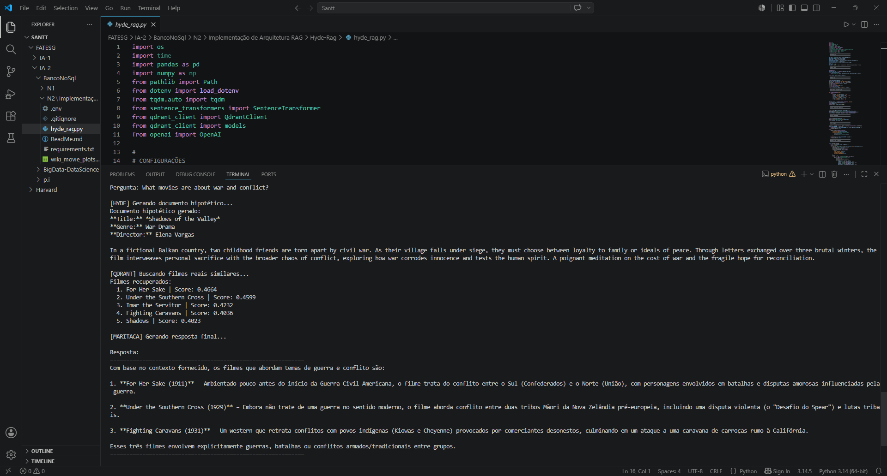
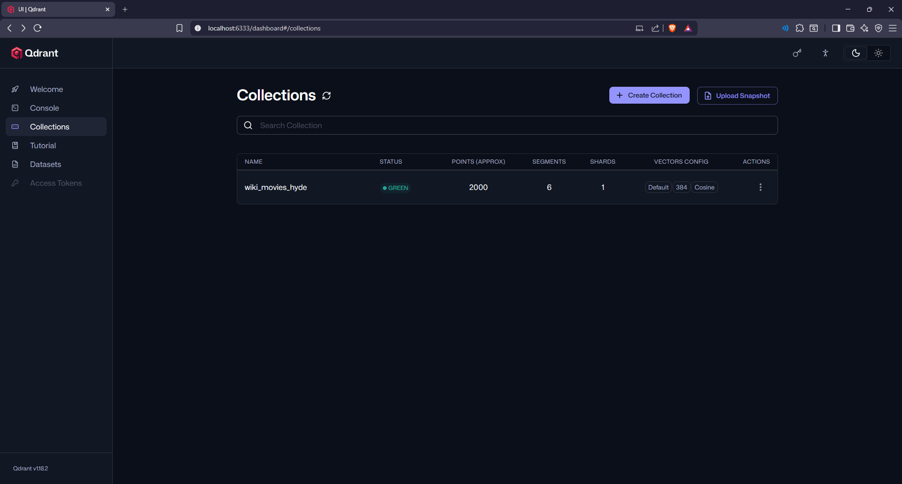

# HyDE RAG — Wikipedia Movie Plots

Implementação de uma arquitetura **HyDE RAG** (Hypothetical Document Embeddings) aplicada ao dataset de plots de filmes da Wikipedia.

---

## O que é HyDE RAG?

O **HyDE RAG** é uma variação do RAG tradicional que melhora a busca semântica gerando um **documento hipotético** antes de realizar a busca no banco vetorial.

### Problema que resolve

No RAG simples, a pergunta do usuário é diretamente embedada e buscada no banco vetorial. Porém, perguntas e documentos têm estilos de escrita muito diferentes — uma pergunta é curta e interrogativa, enquanto um documento é descritivo e denso. Isso causa uma **incompatibilidade semântica** que reduz a qualidade dos resultados.

### Como o HyDE resolve isso

Em vez de embedar a pergunta diretamente, o HyDE:

1. Usa uma LLM para gerar um **documento hipotético** que *responderia* à pergunta
2. Embeda esse documento hipotético (que tem o mesmo estilo dos documentos reais)
3. Usa esse embedding para buscar documentos reais similares no banco vetorial
4. Envia os documentos reais como contexto para a LLM gerar a resposta final

---

## Fluxo da Arquitetura

```
Pergunta do usuário
        ↓
[LLM - Maritaca] Gera documento hipotético
        ↓
[Embedding - all-MiniLM-L6-v2] Vetoriza o documento hipotético
        ↓
[Qdrant] Busca documentos reais similares por similaridade de cosseno
        ↓
[LLM - Maritaca] Gera resposta final com contexto real
        ↓
Resposta ao usuário
```

---

## Tecnologias utilizadas

| Componente | Tecnologia |
|---|---|
| Linguagem | Python 3.14 |
| Banco vetorial | Qdrant (Docker) |
| Modelo de embedding | sentence-transformers/all-MiniLM-L6-v2 |
| LLM | Maritaca AI — sabiazinho-4 |
| Dataset | Wikipedia Movie Plots (Kaggle) |

### O que é a Maritaca?

A **Maritaca AI** é uma empresa brasileira de inteligência artificial que desenvolve LLMs com foco em português. O modelo `sabiazinho-4` utilizado neste projeto é leve, eficiente e possui API compatível com o padrão OpenAI, o que facilita a integração.

---

## Dataset

**Wikipedia Movie Plots** — disponível no Kaggle:  
https://www.kaggle.com/datasets/jrobischon/wikipedia-movie-plots

Contém título, ano, gênero, diretor, elenco e plot de milhares de filmes da Wikipedia.

Neste projeto foram indexados os primeiros **2000 filmes** do dataset.

---

## Estrutura do projeto

```
Hyde-Rag/
├── hyde_rag.py                  # Código principal
├── .env                         # Chave da API (não versionar)
├── requirements.txt             # Dependências
├── wiki_movie_plots_deduped.csv # Dataset (não versionado)
└── README.md                    # Este arquivo
```

---

## Como executar

### 1. Pré-requisitos

- Python 3.x instalado
- Docker Desktop instalado e rodando

### 2. Subir o Qdrant via Docker

```bash
docker run -d -p 6333:6333 -p 6334:6334 --name qdrant qdrant/qdrant
```

### 3. Instalar dependências

```bash
pip install -r requirements.txt
```

### 4. Configurar a chave da API

Crie um arquivo `.env` na pasta do projeto:

```
MARITACA_API_KEY=sua_chave_aqui
```

### 5. Rodar o projeto

```bash
python hyde_rag.py
```

Na primeira execução, o script vai:
- Carregar e processar o dataset
- Baixar o modelo de embedding
- Indexar os filmes no Qdrant
- Iniciar o loop de perguntas

Nas execuções seguintes, a indexação é pulada automaticamente.

---

## Demonstração

### Sistema rodando — fluxo HyDE completo



O terminal mostra as 3 etapas do HyDE: geração do documento hipotético pela Maritaca, busca dos filmes reais no Qdrant e resposta final gerada com o contexto recuperado.

### Banco vetorial Qdrant — coleção indexada



O dashboard do Qdrant confirma a coleção `wiki_movies_hyde` com **2000 pontos** indexados, vetores de **384 dimensões** e métrica de distância **Cosine**.

---

## Exemplos de perguntas e respostas

### Pergunta 1
```
Quais filmes têm um detetive investigando um assassinato?
```

**Documento hipotético gerado pela Maritaca:**
> Title: Shadow in the Rain | Genre: Noir Thriller | Director: Elise Monteiro
> In a fog-shrouded city, seasoned detective Lena Cruz is assigned to the brutal murder of a prominent philanthropist...

**Filmes recuperados pelo Qdrant:** Fog Over Frisco (0.53), Shadows (0.49), Rain (0.49), The Desert Song (0.45), Alibi (0.44)

**Resultado:** O sistema identificou corretamente que nenhum dos filmes indexados apresentava explicitamente um detetive investigando um assassinato, demonstrando que o RAG não alucina respostas.

---

### Pergunta 2
```
What movies are about love and romance?
```

**Documento hipotético gerado:**
> Title: Whispers of the Heart | Genre: Romantic Drama | Director: Elena Voss
> A shy botanist finds herself drawn to her charismatic neighbor...

**Filmes recuperados:** The Heart of Humanity (0.49), Inspiration (0.47), A Lady to Love (0.47), Men Who Have Made Love to Me (0.46), Hearts of the World (0.45)

**Resultado:** O sistema retornou 4 filmes relevantes sobre amor e romance com descrições precisas de cada um.

---

### Pergunta 3
```
What movies are about war and conflict?
```

**Filmes recuperados:** For Her Sake (0.47), Under the Southern Cross (0.46), Imar the Servitor (0.42), Fighting Caravans (0.40), Shadows (0.40)

**Resultado:** O sistema identificou filmes sobre Guerra Civil Americana, conflitos entre tribos e guerras, respondendo corretamente ao tema.

---

## Papel do banco vetorial

O Qdrant armazena os embeddings de cada filme (vetores de 384 dimensões gerados pelo modelo all-MiniLM-L6-v2). Quando o documento hipotético é gerado, ele também é convertido em vetor e o Qdrant realiza uma **busca por similaridade de cosseno** para encontrar os filmes reais mais próximos semanticamente.

O banco vetorial **não define a arquitetura** — o que define é a estratégia de recuperação. No HyDE, essa estratégia é buscar com base em um documento hipotético, não na pergunta direta.

---

## Limitações encontradas

- Os 2000 filmes indexados são majoritariamente filmes antigos (início do século XX), limitando respostas sobre filmes modernos
- Scores de similaridade relativamente baixos (~0.45-0.53) indicam espaço para melhoria com modelos de embedding maiores
- A qualidade do documento hipotético depende diretamente da LLM — perguntas mal formuladas geram hipotéticos ruins
- O modelo all-MiniLM-L6-v2 é leve mas limitado; modelos maiores melhorariam a qualidade da busca
- Perguntas em português com dataset em inglês reduzem a qualidade dos embeddings

---

## Aprendizados

- O HyDE resolve um problema real do RAG básico: a incompatibilidade semântica entre perguntas e documentos
- Gerar um documento hipotético no mesmo estilo dos documentos reais melhora a qualidade do embedding de busca
- O banco vetorial não define a arquitetura — o que define é a estratégia de recuperação
- Um RAG que diz "não encontrei" é melhor do que um que alucina respostas

---

## Impacto em cenário real de mercado

O HyDE RAG seria especialmente útil em:

- **Sistemas de recomendação** onde o usuário descreve o que quer em linguagem natural
- **Busca em bases de documentos técnicos** onde perguntas e respostas têm vocabulários muito diferentes
- **Atendimento ao cliente** onde perguntas vagas precisam encontrar respostas precisas em documentação extensa