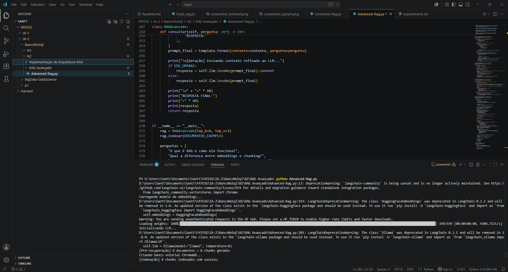
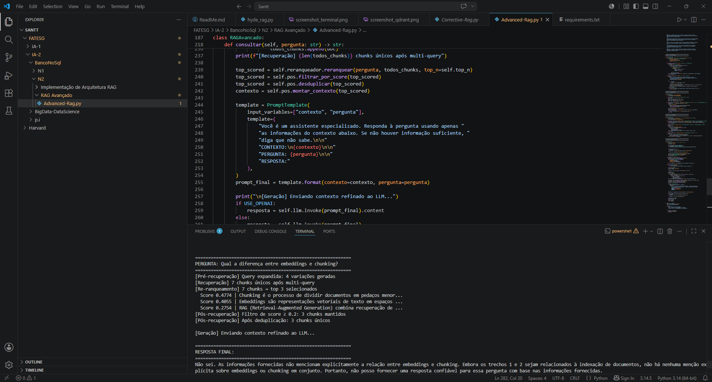
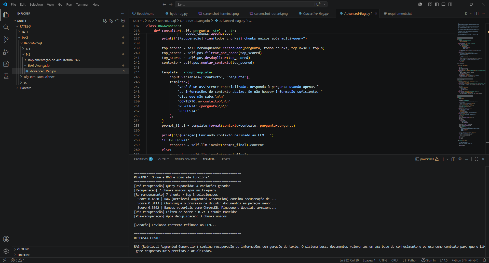

# RAG Avançado — Geração Aumentada por Recuperação

Implementação de um sistema RAG Avançado com técnicas de pré-recuperação, re-ranqueamento e pós-recuperação.

---

## Técnicas Implementadas

- **Pré-recuperação**: chunking com sobreposição, metadados e query expansion (gera variações da consulta)
- **Re-ranqueamento**: reordena os chunks recuperados por similaridade de cosseno com a consulta
- **Pós-recuperação**: filtragem por score mínimo, deduplicação e montagem do contexto final

---

## Como Rodar

```bash
pip install langchain langchain-community chromadb sentence-transformers ollama
ollama pull llama3
python advanced_rag.py
```

---

## Resultados

### Indexação e Pré-recuperação
Documentos divididos em chunks com metadados e consulta expandida em variações.



---

### Recuperação e Re-ranqueamento
Chunks recuperados e reordenados por score de relevância.



---

### Resposta Final Gerada pelo LLM
Contexto refinado enviado ao LLM e resposta gerada.



---

## Fluxo do Pipeline

```
Pergunta → Query Expansion → Recuperação top-k → Re-ranqueamento → Filtragem → LLM → Resposta
```