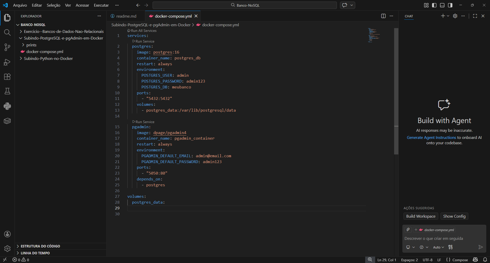
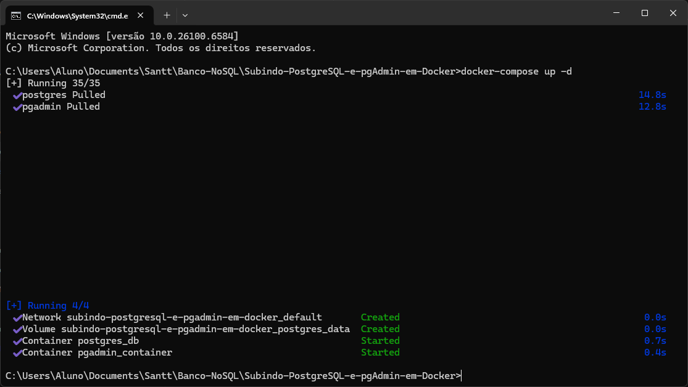
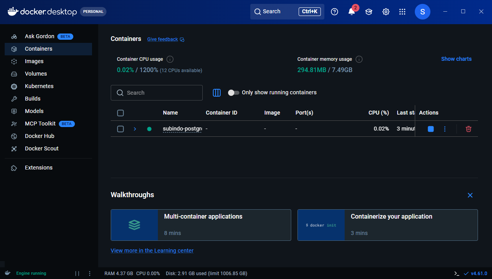
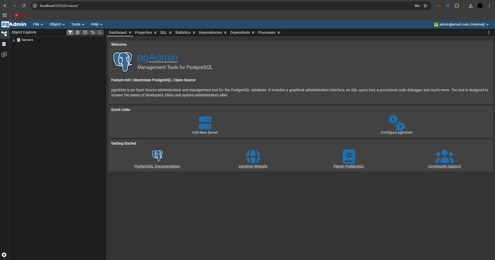

# Tarefa Subindo Python no Docker

Atividade de subir um ambiente de banco de dados usando Docker Compose

## Provas do funcionamento

### 1. Codigo do docker-compose

### 2 . Dando docker-compose up -d no CMD

### 3 . Container Docker Rodando

### 4 . Pagina de Login na PgAdmin

### 5 . Pagina do painel da PgAdmin
