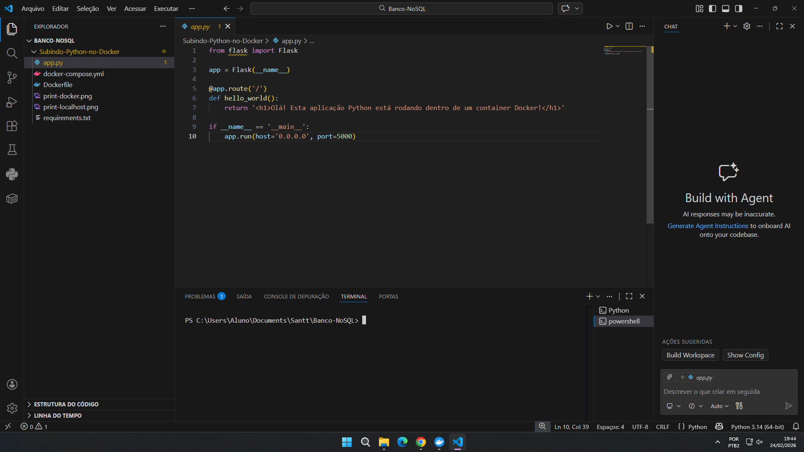
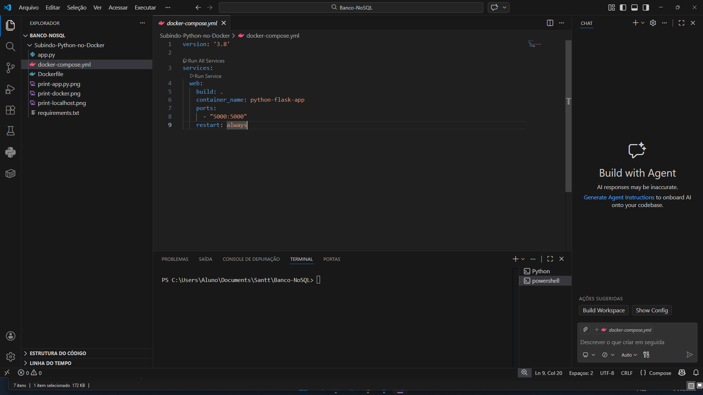
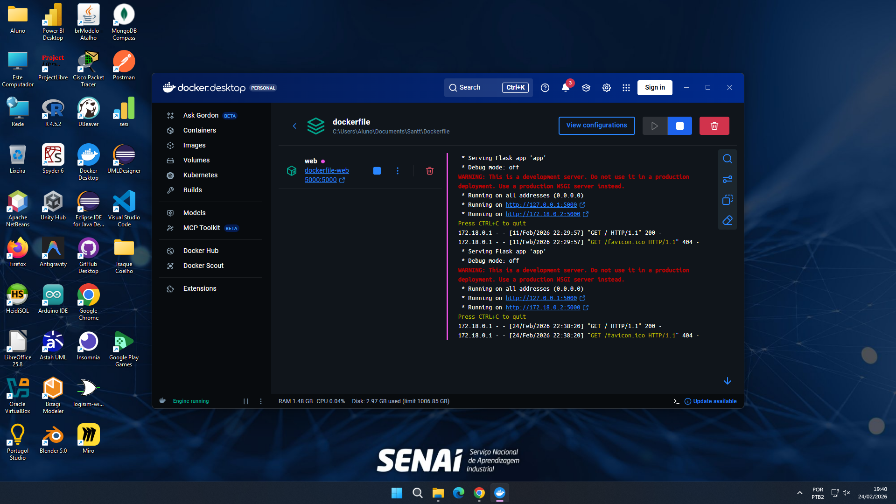
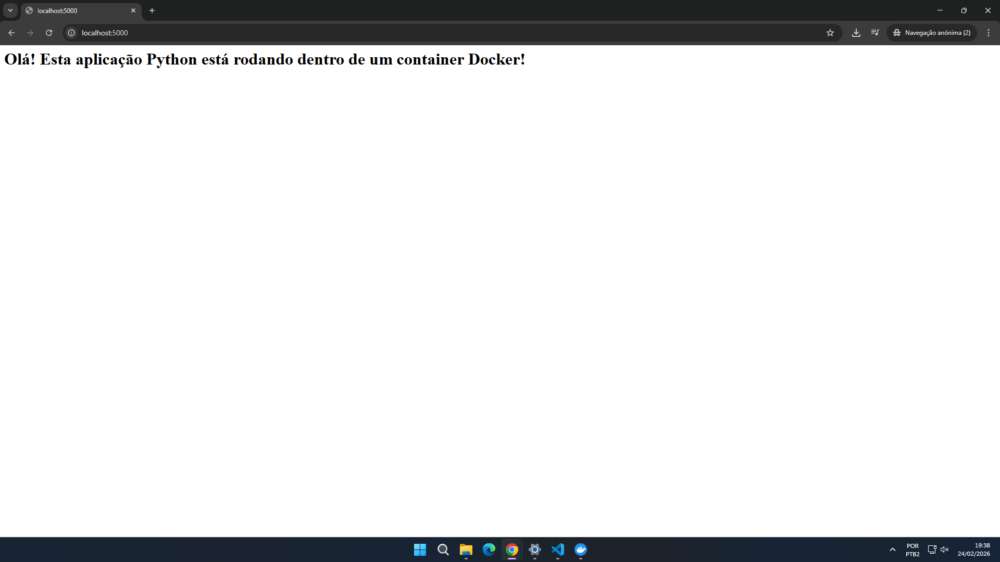

# Tarefa Subindo Python no Docker

Atividade de subir um ambiente de python usando Docker Compse.

## Provas do funcionamento

### 1. Codigo do App

### 2 . Codigo Docker Compose

### 3 . Container Docker Rodando (VsCode)

### 4 . Localhost rodando o container
