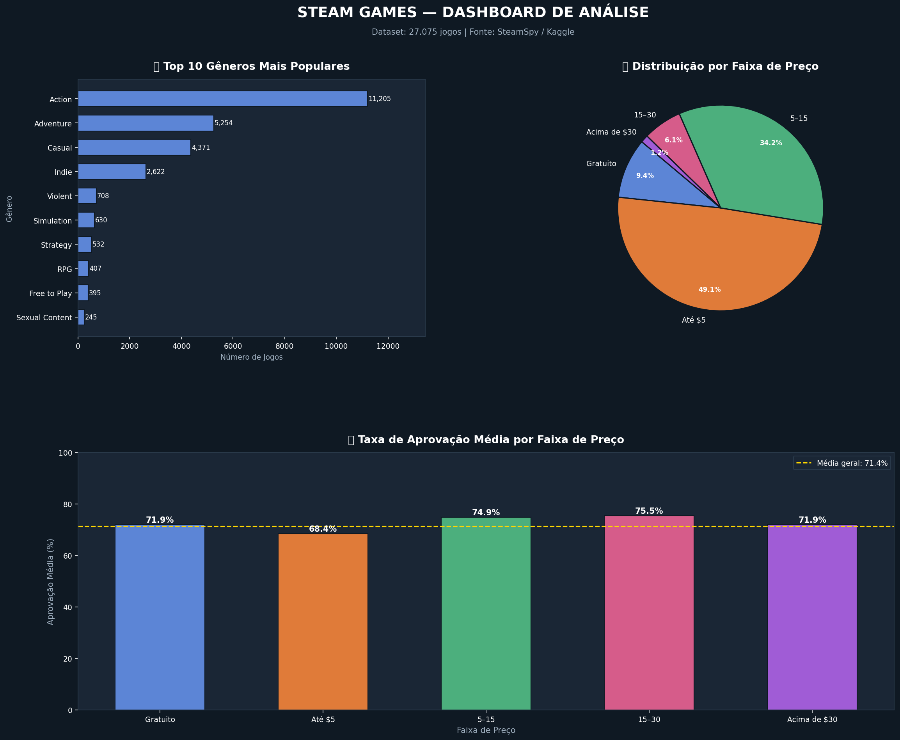
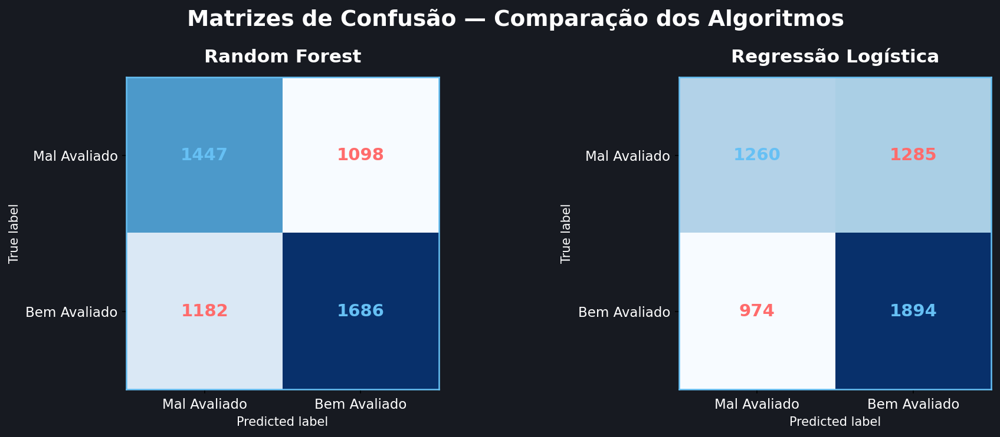

# 🎮 Análise de Dados — Steam Games

Projeto interdisciplinar de Ciência de Dados e Inteligência Artificial  
Análise completa de 27.075 jogos da plataforma Steam.

---

# 👥 Integrantes do Grupo

1. Arthur Machado Santos  
2. Guilherme Nogueira Medeiros

---

# 📁 Estrutura do Repositório

```bash
📦 steam-analysis/
├── 📄 steam.csv                  # Dataset original (SteamSpy / Kaggle)
├── 🐍 estatistica.py             # R1 — Estatística Descritiva
├── 🐍 dashboard.py               # R2 — Dashboard de Visualização
├── 🐍 machine_learning.py        # R3 — Modelagem Preditiva (ML)
├── 🖼️ dashboard.png              # Dashboard gerado
├── 🖼️ matrizes_confusao.png      # Matrizes de confusão
└── 📄 README.md                  # Este arquivo
```

---

# 📊 Sobre o Dataset

**Fonte:** Steam Games Dataset — Kaggle / SteamSpy

O dataset contém informações de **27.075 jogos** publicados na plataforma Steam, coletadas via API do SteamSpy.

Os dados abrangem:

- Características técnicas
- Informações comerciais
- Engajamento dos jogadores
- Avaliações da comunidade

---

# 📋 Dicionário de Dados

| Coluna | Tipo | Descrição |
|---|---|---|
| `appid` | int | Identificador único do jogo |
| `name` | str | Nome do jogo |
| `release_date` | str | Data de lançamento |
| `english` | int | Suporte ao inglês (1 = sim, 0 = não) |
| `developer` | str | Empresa/pessoa desenvolvedora |
| `publisher` | str | Empresa distribuidora |
| `platforms` | str | Plataformas suportadas |
| `required_age` | int | Classificação etária |
| `categories` | str | Categorias do jogo |
| `genres` | str | Gêneros do jogo |
| `steamspy_tags` | str | Tags da comunidade |
| `achievements` | int | Número de conquistas |
| `positive_ratings` | int | Avaliações positivas |
| `negative_ratings` | int | Avaliações negativas |
| `average_playtime` | int | Tempo médio de jogo |
| `median_playtime` | int | Tempo mediano de jogo |
| `owners` | str | Faixa estimada de proprietários |
| `price` | float | Preço em USD |
| `approval_rate*` | float | Taxa de aprovação calculada |

> *A coluna `approval_rate` foi criada durante a análise e não existe no CSV original.*

---

# 🗂️ Etapa 1 — R1: Estatística Descritiva

**Arquivo:** `estatistica.py`

## 📌 Resumo Analítico

O projeto analisa o mercado de jogos digitais da Steam sob diferentes perspectivas:

- Precificação
- Recepção da comunidade
- Engajamento dos jogadores
- Diversidade de gêneros

A grande variação das variáveis reflete a natureza heterogênea da plataforma, que reúne desde jogos AAA até jogos independentes (indie).

---

## 📈 Variáveis Analisadas

Para cada variável foram calculados:

- Média
- Mediana
- Moda
- Desvio padrão
- Variância
- Valor mínimo
- Valor máximo
- Quartis (Q1, Q2, Q3)
- IQR

| Variável | Descrição |
|---|---|
| `price` | Preço do jogo |
| `positive_ratings` | Avaliações positivas |
| `negative_ratings` | Avaliações negativas |
| `average_playtime` | Tempo médio de jogo |
| `achievements` | Número de conquistas |
| `approval_rate` | Taxa de aprovação |

---

## 🔍 Principais Descobertas

- O preço médio dos jogos é aproximadamente **$6,08**
- A mediana é **$3,99**, indicando presença de outliers
- 75% dos jogos custam menos de **$7,19**
- A taxa média de aprovação é próxima de **70%**
- O tempo médio de jogo apresenta alta variabilidade

---

# 📈 Etapa 2 — R2: Dashboard de Visualização

**Arquivo:** `dashboard.py`  
**Saída:** `dashboard.png`

O dashboard foi desenvolvido utilizando **Matplotlib** e contém 3 gráficos principais.

---

## 📊 Gráfico 1 — Top 10 Gêneros Mais Populares

Gráfico de barras horizontais exibindo os gêneros com maior número de jogos na plataforma.

---

## 🥧 Gráfico 2 — Distribuição por Faixa de Preço

Gráfico de pizza segmentando os jogos em 5 faixas de preço:

- Gratuito
- Até $5
- $5–$15
- $15–$30
- Acima de $30

---

## 📉 Gráfico 3 — Taxa de Aprovação por Faixa de Preço

Gráfico comparando a aprovação média dos jogos em cada faixa de preço.

---



---

# 🤖 Etapa 3 — R3: Modelagem Preditiva (Machine Learning)

**Arquivo:** `machine_learning.py`  
**Saída:** `matrizes_confusao.png`

---

# 🎯 Objetivo

Classificar se um jogo será:

- **Bem avaliado** (aprovação ≥ 75%)
- **Mal avaliado** (aprovação < 75%)

Problema de **classificação binária**.

---

# 🧠 Features Utilizadas

```python
[
    "price",
    "achievements",
    "average_playtime",
    "median_playtime",
    "required_age",
    "tem_windows",
    "tem_mac",
    "tem_linux",
    "genre_cod",
    "is_free"
]
```

---

# 📂 Divisão dos Dados

| Conjunto | Proporção | Registros |
|---|---|---|
| Treino | 80% | ~21.600 |
| Teste | 20% | ~5.400 |

---

# 🌲 Algoritmo 1 — Random Forest

## 📌 Justificativa

Escolhido por:

- Robustez contra outliers
- Bom desempenho em dados heterogêneos
- Capacidade de lidar com relações não-lineares
- Importância das features

## ⚙️ Configuração

```python
RandomForestClassifier(
    n_estimators=100,
    random_state=42
)
```

---

# 📉 Algoritmo 2 — Regressão Logística

## 📌 Justificativa

Escolhido como baseline por ser:

- Interpretável
- Rápido
- Clássico em classificação binária

## ⚙️ Configuração

```python
LogisticRegression(
    max_iter=1000,
    random_state=42
)
```

---

# 📊 Comparação dos Algoritmos

| Métrica | Random Forest | Regressão Logística |
|---|---|---|
| Acurácia | Executar para ver | Executar para ver |
| Precisão | Executar para ver | Executar para ver |
| Recall | Executar para ver | Executar para ver |
| F1-Score | Executar para ver | Executar para ver |

> Execute `machine_learning.py` para preencher os resultados reais.

---



---

# ✅ Conclusão

O Random Forest tende a apresentar melhor desempenho neste dataset devido à presença de:

- Relações não-lineares
- Outliers
- Dados heterogêneos

A Regressão Logística, apesar da menor performance esperada, fornece maior interpretabilidade e funciona como baseline sólido.

---

# ▶️ Como Executar

## 📦 Pré-requisitos

```bash
pip install pandas numpy matplotlib scikit-learn
```

---

## 🚀 Ordem de Execução

### 1️⃣ Estatística Descritiva

```bash
python estatistica.py
```

### 2️⃣ Dashboard

```bash
python dashboard.py
```

### 3️⃣ Machine Learning

```bash
python machine_learning.py
```

> ⚠️ O arquivo `steam.csv` deve estar na mesma pasta dos scripts Python.

---

# 🛠️ Tecnologias Utilizadas

| Tecnologia | Uso |
|---|---|
| Python | Linguagem principal |
| Pandas | Manipulação de dados |
| NumPy | Cálculos numéricos |
| Matplotlib | Visualização |
| Scikit-learn | Machine Learning |

---

# 📚 Referências

- Steam Store Games — Kaggle
- Scikit-learn Documentation
- Pandas Documentation
- SteamSpy API
