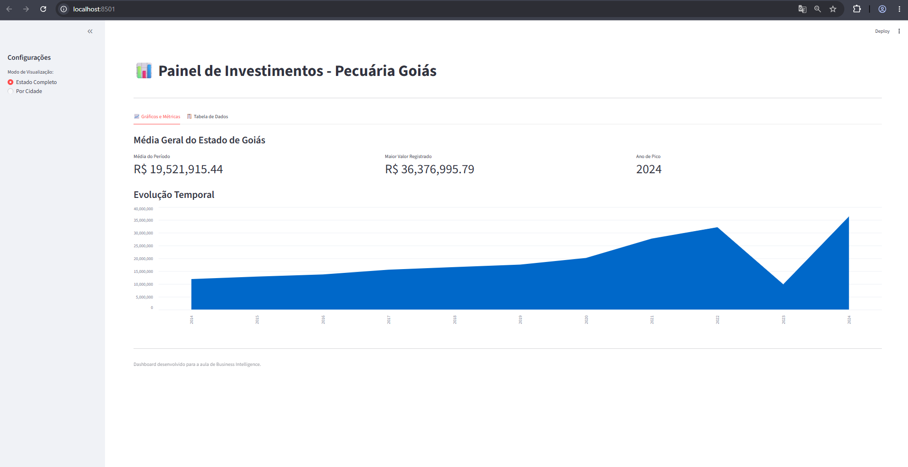
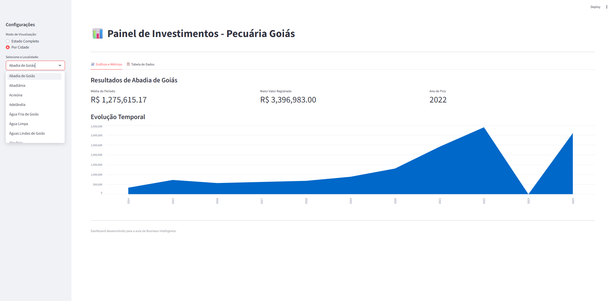

Dashboard de Investimentos em Pecuária - Goiás
Este projeto consiste em um dashboard interativo desenvolvido para a análise de investimentos no setor de pecuária no estado de Goiás, cobrindo o período de 2014 a 2024. A aplicação utiliza dados extraídos de arquivos CSV para gerar indicadores de Business Intelligence (BI).
Funcionalidades
O sistema processa uma base de dados financeira e realiza as seguintes operações:
Tratamento de Dados: O script converte valores monetários em formato de texto (com pontos e vírgulas) para o formato numérico decimal. Também gerencia campos vazios ou inconsistentes, garantindo que a análise estatística seja precisa.
Visão por Localidade: Através de um filtro na barra lateral, é possível selecionar uma cidade específica para visualizar o histórico individual de investimentos.
Visão Consolidada: O dashboard oferece uma visão da média geral de todas as cidades do estado, permitindo identificar tendências globais no setor pecuário.
Métricas de BI: Exibe indicadores automáticos como a média do período, o maior valor registrado no histórico e o ano em que ocorreu o pico de investimento.
Gráficos e Tabelas: Utiliza gráficos de área para mostrar a evolução temporal e tabelas interativas para exibição dos dados brutos.
Capturas de Tela
Abaixo estão as representações visuais das funcionalidades implementadas:
Filtro por Cidade
Nesta visão, o dashboard isola os dados de uma localidade específica e ajusta as métricas de acordo com os valores daquela prefeitura.

Visão Geral do Estado
Nesta visão, o dashboard calcula a média de todas as entradas do arquivo para apresentar o desempenho consolidado de Goiás.

Tecnologias Utilizadas
Python
Pandas (Processamento e limpeza de dados)
Streamlit (Interface e visualização de BI)
Como executar
Para rodar o projeto localmente, é necessário ter o Python instalado e seguir os passos abaixo:
Navegar até a pasta do projeto via terminal.
Instalar as dependências necessárias.
Executar o comando:
code
Bash
streamlit run main.py